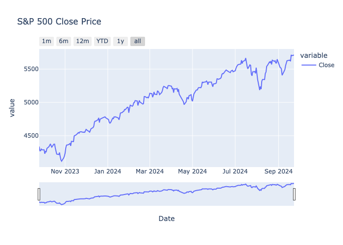
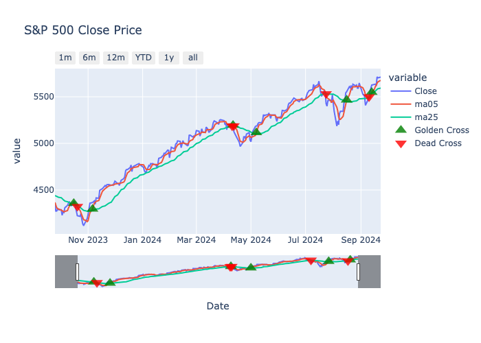

## Viewer for Stock Price Data

**File:** `view_stock_data.ipynb`

### Overview

This notebook retrieves stock price data for a specified symbol, calculates technical indicators, and visualizes the data using various methods. It highlights trends in stock prices and key crossover points, such as Golden Cross and Dead Cross, with the help of different visualization tools and techniques.

### Libraries Used
- **yfinance**: Fetching stock price data
- **mplfinance**: Plotting advanced stock charts (Golden Cross & Dead Cross visualization)
- **plotly**: Interactive stock chart plotting
- **talib**: Calculating technical indicators like MACD

### Visualization Methods
- **Matplotlib & mplfinance**: Displaying candlestick charts, moving averages, Golden Cross, and Dead Cross events.
- **Plotly**: Interactive visualization of stock price trends, with MACD and signal line overlays.

### Output (result)

---
## Backtesting Stock Trading Strategies

**Files:** `backtest.py` and `indicators.py`

### Overview

This project backtests stock trading strategies using `Backtesting.py` with moving averages and MACD. The strategies are optimized and tested on historical stock data.

### Key Features
1. Stock data retrieval for backtesting.
2. Backtesting of different trading strategies.
3. **Strategy optimization**: Parameters such as moving average periods and MACD settings are optimized to maximize final equity or return percentage.
4. Results display and performance plots.

### Visualization Methods
- Plots of backtest results.
- Final equity, return percentage, and optimized strategy parameters.

## Output (result)
- [Non-Optimized Data](https://edonow.github.io/stock-data/MACDStrategy.html)
- [Optimized Data](https://edonow.github.io/stock-data/MACDStrategy(n1=24,n2=70,n_signal=4).html)
